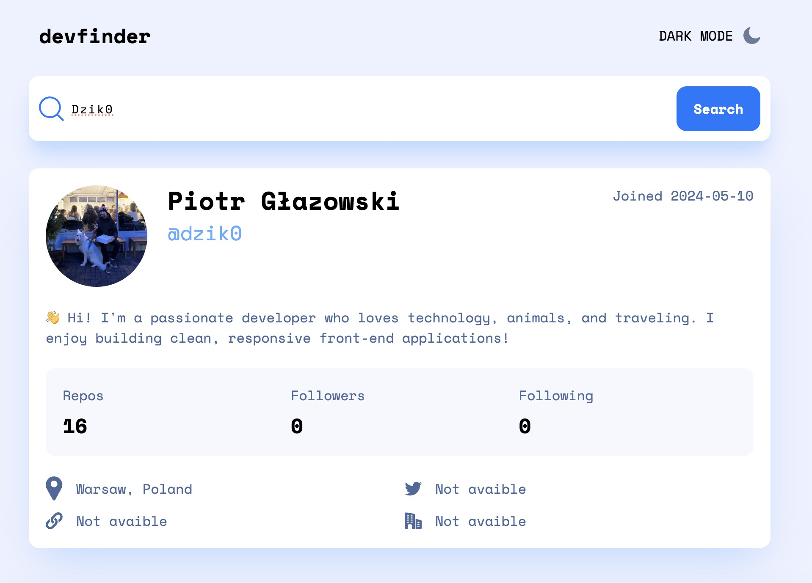

# GitHub User Search App

.

## Screenshot



The app is deployed and automatically updated with every commit using [Vercel](https://vercel.com/). See [the live version here](https://user-search-three.vercel.app/).

## Features

- **Live GitHub Search:**  
  Enter a username to instantly fetch and display GitHub user data.
- **Responsive Design:**  
  Looks great on desktop and mobile devices.
- **Light/Dark Mode:**  
  Toggle between dark and light themes for comfortable viewing.
- **Detailed User Profiles:**  
  View avatar, name, join date, bio, repos, followers/following, location, website, Twitter, and company info.
- **Graceful Error Handling:**  
  Displays clear messages when the user is not found.

## Demo

Check out the live demo:  
https://user-search-three.vercel.app/


- **Framework:** [Next.js](https://nextjs.org/)
- **Hosting:** [Vercel](https://vercel.com/)
- **UI:** React, Tailwind CSS (via `clsx` for conditional styling)
- **API:** GitHub Users API

## Getting Started

1. **Clone the repo:**

   ```bash
   git clone https://github.com/your-username/your-repo.git
   cd your-repo
   ```

2. **Install dependencies:**

   ```bash
   npm install
   ```

3. **Run the development server:**
   ```bash
   npm run dev
   ```
   Open http://localhost:3000 in your browser.

## Project Structure

- `/pages` – Next.js routes and app logic
- `/public` – Static assets (including `screenshot.jpeg`)
- `/components` – React UI components
- `/styles` – CSS/utility styles

## Usage

- Search by GitHub username via the search bar.
- Switch between light and dark mode.
- View detailed public info for any GitHub user.

## License

This project is open-source. Feel free to use and modify as you wish.

**Enjoy exploring GitHub users!**
